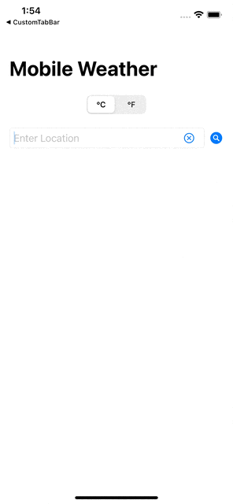
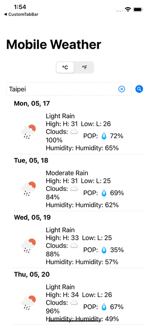

# SwiftUI - WeatherForecast
 

  

WeatherForecast application provides user 7 Day weahter forecast.

## Features

- [x] Creating an APIService shared Singleton
- [x] Using Singleton to Fetch Data from API
- [x] Using OpenWeatherMap API
- [x] Follow MMVM Pattern
- [x] Switching between Metric and Imperial Units
- [x] Handling errors and displaying Activity Loader

## Requirements

- iOS 13.0+
- SwiftUI

## Installation

Clone the project and run in your local workstation. 

## Acknowledgements
- This project was inspired and follow by [Youtube - Stewart Lynch](https://www.youtube.com/watch?v=FA4ksgVip9E&t=84s)

## Contact
Created by [@Hung-Chun, Tsai (Carter)](linkedin.com/in/hung-chun-carter-tsai-372584175) - feel free to contact me!

<i>Follow me around the web:</i> 

<!-- <a target="_blank" href="https://www.linkedin.com/in/hung-chun-carter-tsai-372584175/">🇱​🇮​🇳​🇰​🇪​🇩​🇮​🇳​</a> ●
<a target="_blank" href="https://www.instagram.com/hungchun.tsai/">🇮​🇳​🇸​🇹​🇦​🇬​🇷​🇦​🇲​</a> ●
<a target="_blank" href="https://www.facebook.com/hongjun.cai.5">🇫​🇦​🇨​🇪​🇧​🇴​🇴​🇰​</a> ● -->

